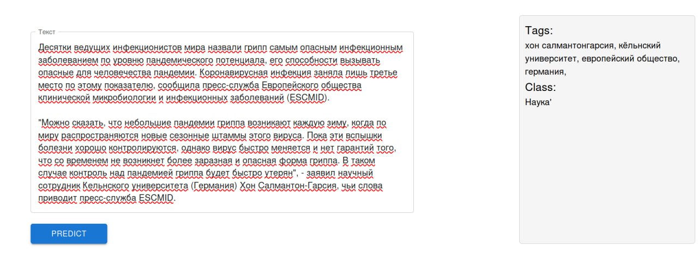

# 🥉 MISIS Drak Horse

Генерация новостных тегов

## Описание задачи

Чтобы помочь рекомендательной системе VK наиболее эффективно выдавать новости, преддлагается разработать сервис, который будет проводить тэгирование новостных статей.

Предлагается разработать:

- Алгоритм присвоения тегов к новости
- WEB-сервис, где можно протестировать алгоритм

## Наше решение

### Алгоритм

Всего у нас 4 глобальных классов, с помощью кластеризации внутри каждого класса выделили подклассы, по частоте употребляемых слов определили ключевые темы кластеров, таким образом получили целевой столбец. Для кластеризации использовали эмбеддинги, полученные из RuBert-tiny. Обучили модель FastText для классификации текстов на наш целевой столбец. Обучили на наших текстах, а так же на 100 000 новых новостей, подгруженных с открытых источников.

[Embedd-Bert](ml/embedd-bert.ipynb)  
[vk-hse-model](ml/vk-hse-model.ipynb)

### Сервис



Как запустить:

```sh
$ docker-compose up -d --build
```

WEB-сревис [http://localhost:3000](http://localhost:3000)

Backend Swagger [http://localhost:8004](http://localhost:8004)  
Flower dashboard [http://localhost:5556](http://localhost:5556)

Стек технологий:
Backend: Python, FastAPI, Redis, Celery  
Frontend: React, MUI
